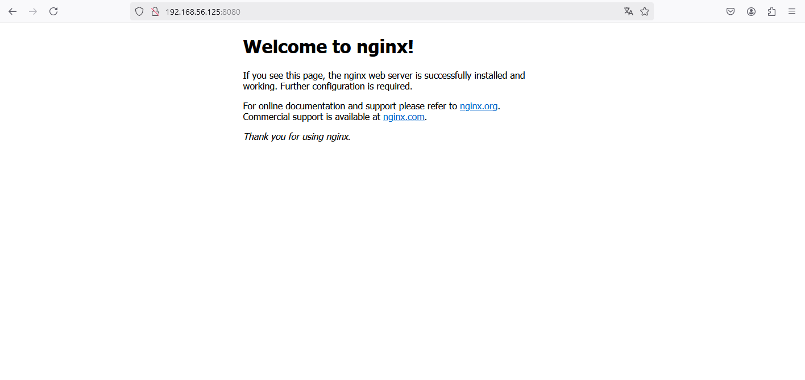

# Сбор и анализ логов Vagrant+ansible - стенд c Rsyslog

## Цель домашнего задания  
Научится проектировать централизованный сбор логов. Рассмотреть особенности разных платформ для сбора логов.

### Описание домашнего задания  

1. В Vagrant разворачиваем 2 виртуальные машины web и log
2. на web настраиваем nginx
3. на log настраиваем центральный лог сервер на любой системе на выбор
•	journald;
•	rsyslog;
•	elk.
4. настраиваем аудит, следящий за изменением конфигов nginx 

Все критичные логи с web должны собираться и локально и удаленно.
Все логи с nginx должны уходить на удаленный сервер (локально только критичные).
Логи аудита должны также уходить на удаленную систему.

Формат сдачи ДЗ - vagrant + ansible

Дополнительное задание
•	развернуть еще машину с elk
•	таким образом настроить 2 центральных лог системы elk и какую либо еще;
•	в elk должны уходить только логи Nginx;
•	во вторую систему все остальное.

   

## Введение:   

Функция системного журналирования (логирование) — это основной источник информации о работе системы и ошибках. В системе Linux почти все действия записываются. Именно эти данные помогают разбираться в проблемах с ОС.
Логи могут храниться как локально, так и пересылаться на удаленную систему. Пересылка логов имеет следующие плюсы:
•	Возможность централизованного сбора и анализа логов (все логи со всех устройств прилетают в одно место. Это значительно упростит работу с логами)
•	Защита от удаления логов на локальной машине 
•	Оптимизация места на диске в локальной ОС (логи не будут храниться в ОС, т.к. будут сразу пересылаться в систему сбора логов. Данная функция настраивается отдельно)

В ОС Linux главным файлом локального журналирования является:
•	Ubuntu/Debian — /var/log/syslog
Логи в ОС можно настроить. Например, указывать больше информации или отключить логирование конкретного компонента. 
Помимо логов, в Unix-системах используют аудит. В linux эту функцию выполняет linux audit daemon.
Linux Audit Daemon - это среда, позволяющая проводить аудит событий в системе Linux. Используя мощную систему аудита возможно отслеживать многие типы событий для мониторинга и проверки системы, например:
•	доступ к файлам;
•	изменение прав на файлы;
•	просмотр пользователей, изменивших конкретный файл;
•	обнаружение несанкционированных изменений;
•	мониторинг системных вызовов и функций;
•	обнаружение аномалий, таких как сбои;
•	мониторинг набора команд.

Аудит различает 4 вида доступа к файлу:
•	r — чтение 
•	w — запись в файл 
•	x — выполнение файла
•	a — изменение атрибута

Функциональные и нефункциональные требования
•	ПК на Unix c 8ГБ ОЗУ или виртуальная машина с включенной Nested Virtualization.
Предварительно установленное и настроенное следующее ПО: 
•	Hashicorp Vagrant (https://www.vagrantup.com/downloads) 
•	Oracle VirtualBox (https://www.virtualbox.org/wiki/Linux_Downloads). 
Ansible (версия 2.7 и выше) - https://docs.ansible.com/ansible/latest/installation_guide/intro_installation.html
   
# Выполнение:  


## 1. Создал Vagranfile

```vagrantfile

Vagrant.configure("2") do |config|

  
  config.vm.provider :virtualbox do |v|
    v.memory = 2048
    v.cpus = 2
  end

  
  config.vm.define "logserver" do |log|
    log.vm.box = "bento/ubuntu-22.04"
    log.vm.hostname = "logserver"
    log.vm.network :private_network, ip: "192.168.57.10"
    log.vm.network "forwarded_port", guest: 60, host: 1160
  end

  
  config.vm.define "webserver" do |web|
    web.vm.box = "bento/ubuntu-22.04"
    web.vm.hostname = "webserver"
    web.vm.network :private_network, ip: "192.168.57.20"
    web.vm.network "forwarded_port", guest: 80, host: 8080
    web.vm.network "forwarded_port", guest: 514, host: 1514
  end

  
  config.vm.provision "ansible" do |ansible|
    ansible.playbook = "playbooks/log.yml"
    ansible.inventory_path = "inventory"
    ansible.extra_vars = {
      ansible_user: "vagrant",
      ansible_ssh_private_key_file: "~/.vagrant.d/insecure_private_key"
    }
  end
end

```   

## 2. Написал Playbook log.yml   

```yml
---
- import_playbook: update.yml
- import_playbook: chrony.yml
- import_playbook: nginx.yml
- import_playbook: rsyslog-server.yml
- import_playbook: audit.yml
```   

#### 2.1 Создал структуру проекта с ролями   

   


## 3. Далее выполнил команду vagrant up   

```shell
root@ubuntu:/home/guared/log# vagrant up
Bringing machine 'logserver' up with 'virtualbox' provider...
Bringing machine 'webserver' up with 'virtualbox' provider...

...

    logserver: Running ansible-playbook...

...

PLAY RECAP *********************************************************************
logserver                  : ok=18   changed=6    unreachable=0    failed=0    skipped=0    rescued=0    ignored=0

     webserver: Running ansible-playbook...

...

PLAY RECAP *********************************************************************
webserver                  : ok=18   changed=6    unreachable=0    failed=0    skipped=0    rescued=0    ignored=0
```   
Playbook отработал без ошибок   
   

## 4. Пробую в браузере открыть стартовую страницу web сервера   




## 5. Убедился что на обоих машинах одинаковая дата и время   

```shell
root@logserver:~# date
Wed Jan 29 12:22:45 PM MSK 2025
```   
```shell
root@webserver:~# date
Wed Jan 29 12:22:50 PM MSK 2025
```

## 6.  Перешел к машине logserver и убедился что порт 514 rsyslog открыт, а сам rsyslog запущен и раюотает корректно 

```shell

root@logserver:~# systemctl status rsyslog
● rsyslog.service - System Logging Service
     Loaded: loaded (/lib/systemd/system/rsyslog.service; enabled; vendor preset: enabled)
     Active: active (running) since Wed 2025-01-29 10:22:32 MSK; 1h 52min ago
TriggeredBy: ● syslog.socket
       Docs: man:rsyslogd(8)
             man:rsyslog.conf(5)
             https://www.rsyslog.com/doc/
   Main PID: 50699 (rsyslogd)
      Tasks: 10 (limit: 1010)
     Memory: 592.0M
        CPU: 50min 54.919s
     CGroup: /system.slice/rsyslog.service
             └─50699 /usr/sbin/rsyslogd -n -iNONE

Jan 29 10:22:32 logserver systemd[1]: Starting System Logging Service...
Jan 29 10:22:32 logserver systemd[1]: Started System Logging Service.
Jan 29 10:22:32 logserver rsyslogd[50699]: imuxsock: Acquired UNIX socket '/run/systemd/journal/syslog' (fd 3) from systemd.  [v8.2112.>
Jan 29 10:22:32 logserver rsyslogd[50699]: [origin software="rsyslogd" swVersion="8.2112.0" x-pid="50699" x-info="https://www.rsyslog.c>
Jan 29 10:22:34 logserver rsyslogd[50699]: imjournal: journal files changed, reloading...  [v8.2112.0 try https://www.rsyslog.com/e/0 ]
Jan 29 11:01:55 logserver rsyslogd[50699]: imjournal: journal files changed, reloading...  [v8.2112.0 try https://www.rsyslog.com/e/0 ]
Jan 29 11:07:49 logserver rsyslogd[50699]: imjournal: journal files changed, reloading...  [v8.2112.0 try https://www.rsyslog.com/e/0 ]

root@logserver:~# ss -ntuln
Netid        State         Recv-Q        Send-Q                Local Address:Port               Peer Address:Port        Process
udp          UNCONN        0             0                         127.0.0.1:323                     0.0.0.0:*
udp          UNCONN        0             0                           0.0.0.0:514                     0.0.0.0:*
udp          UNCONN        0             0                     127.0.0.53%lo:53                      0.0.0.0:*
udp          UNCONN        0             0                    10.0.2.15%eth0:68                      0.0.0.0:*
udp          UNCONN        0             0                             [::1]:323                        [::]:*
udp          UNCONN        0             0                              [::]:514                        [::]:*
tcp          LISTEN        0             4096                  127.0.0.53%lo:53                      0.0.0.0:*
tcp          LISTEN        0             128                         0.0.0.0:22                      0.0.0.0:*
tcp          LISTEN        0             25                          0.0.0.0:514                     0.0.0.0:*
tcp          LISTEN        0             128                            [::]:22                         [::]:*
tcp          LISTEN        0             25                             [::]:514                        [::]:*

```   

## 7. Подключился на web сервер: vagrant ssh web   
проверил версию nginx    

```shell  
root@webserver:~# nginx -v
nginx version: nginx/1.18.0 (Ubuntu)

```

посмотрел конфиг /etc/nginx/nginx.conf, все ли верно настроено   

```shell  

root@webserver:~# cat /etc/nginx/nginx.conf
user www-data;
worker_processes auto;
pid /run/nginx.pid;

events {
    worker_connections 1024;
}

http {
    sendfile on;
    tcp_nopush on;
    tcp_nodelay on;
    keepalive_timeout 65;
    types_hash_max_size 2048;

    include /etc/nginx/mime.types;
    default_type application/octet-stream;


    access_log /var/log/nginx/access.log;
    error_log /var/log/nginx/error.log;


    access_log syslog:server=192.168.57.10:514,facility=local7,tag=nginx_access,severity=info;
    error_log syslog:server=192.168.57.10:514,facility=local7,tag=nginx_error,severity=error;

    server {
        listen 80;
        server_name vagrant;

        location / {
            root /var/www/html;
            index index.nginx-debian.html;
        }
    }
}

```

## 8. Делаю несколько curl запросов на web сервер  

```shell

root@ubuntu:/home/guared/log# curl http://192.168.57.20
<!DOCTYPE html>
<html>
<head>
<title>Welcome to nginx!</title>
<style>
    body {
        width: 35em;
        margin: 0 auto;
        font-family: Tahoma, Verdana, Arial, sans-serif;
    }
</style>
</head>
<body>
<h1>Welcome to nginx!</h1>
<p>If you see this page, the nginx web server is successfully installed and
working. Further configuration is required.</p>

<p>For online documentation and support please refer to
<a href="http://nginx.org/">nginx.org</a>.<br/>
Commercial support is available at
<a href="http://nginx.com/">nginx.com</a>.</p>

<p><em>Thank you for using nginx.</em></p>
</body>
</html>

root@ubuntu:/home/guared/log# curl http://192.168.57.20/45fg
<html>
<head><title>404 Not Found</title></head>
<body>
<center><h1>404 Not Found</h1></center>
<hr><center>nginx/1.18.0 (Ubuntu)</center>
</body>
</html>

```   
на log сервере смотрю информацию о nginx   

```shell
root@logserver:~# cat /var/log/rsyslog/webserver/nginx_access.log
Jan 29 13:37:02 webserver nginx_access: 192.168.57.1 - - [29/Jan/2025:13:37:02 +0300] "GET / HTTP/1.1" 200 612 "-" "curl/8.5.0"
Jan 29 13:37:03 webserver nginx_access: 192.168.57.1 - - [29/Jan/2025:13:37:03 +0300] "GET / HTTP/1.1" 200 612 "-" "curl/8.5.0"
Jan 29 13:37:03 webserver nginx_access: 192.168.57.1 - - [29/Jan/2025:13:37:03 +0300] "GET / HTTP/1.1" 200 612 "-" "curl/8.5.0"
Jan 29 13:37:06 webserver nginx_access: 192.168.57.1 - - [29/Jan/2025:13:37:06 +0300] "GET /45 HTTP/1.1" 404 162 "-" "curl/8.5.0"
Jan 29 13:37:09 webserver nginx_access: 192.168.57.1 - - [29/Jan/2025:13:37:09 +0300] "GET /45 HTTP/1.1" 404 162 "-" "curl/8.5.0"
Jan 29 13:37:09 webserver nginx_access: 192.168.57.1 - - [29/Jan/2025:13:37:09 +0300] "GET /45 HTTP/1.1" 404 162 "-" "curl/8.5.0"

root@logserver:~# cat /var/log/rsyslog/webserver/nginx_error.log
Jan 29 13:37:06 webserver nginx_error: 2025/01/29 13:37:06 [error] 48130#48130: *24 open() "/var/www/html/45" failed (2: No such file or directory), client: 192.168.57.1, server: vagrant, request: "GET /45 HTTP/1.1", host: "192.168.57.20"
Jan 29 13:37:09 webserver nginx_error: 2025/01/29 13:37:09 [error] 48130#48130: *25 open() "/var/www/html/45" failed (2: No such file or directory), client: 192.168.57.1, server: vagrant, request: "GET /45 HTTP/1.1", host: "192.168.57.20"
Jan 29 13:37:09 webserver nginx_error: 2025/01/29 13:37:09 [error] 48130#48130: *26 open() "/var/www/html/45" failed (2: No such file or directory), client: 192.168.57.1, server: vagrant, request: "GET /45 HTTP/1.1", host: "192.168.57.20"
```   

## 9. Посмотрел правила аудита, следящие за изменением конфигов nginx   

```shell

root@webserver:~# auditctl -l
-w /etc/nginx/nginx.conf -p wa -k nginx_conf
-w /etc/nginx/default.d -p wa -k nginx_conf

```   

```shell
root@webserver:~# ausearch -k nginx_conf
The disp_qos option is deprecated - line 8
The dispatcher option is deprecated - line 9
Skipping line 19 in /etc/audit/auditd.conf: too long
----
time->Wed Jan 29 16:04:49 2025
type=PROCTITLE msg=audit(1738155889.094:331257): proctitle=2F7362696E2F617564697463746C002D52002F6574632F61756469742F61756469742E72756C6573
type=SYSCALL msg=audit(1738155889.094:331257): arch=c000003e syscall=44 success=yes exit=1088 a0=3 a1=7ffd7af27870 a2=440 a3=0 items=0 ppid=52398 pid=52411 auid=4294967295 uid=0 gid=0 euid=0 suid=0 fsuid=0 egid=0 sgid=0 fsgid=0 tty=(none) ses=4294967295 comm="auditctl" exe="/usr/sbin/auditctl" subj=unconfined key=(null)
type=CONFIG_CHANGE msg=audit(1738155889.094:331257): auid=4294967295 ses=4294967295 subj=unconfined op=add_rule key="nginx_conf" list=4 res=1
----
time->Wed Jan 29 16:04:49 2025
type=PROCTITLE msg=audit(1738155889.094:331258): proctitle=2F7362696E2F617564697463746C002D52002F6574632F61756469742F61756469742E72756C6573
type=PATH msg=audit(1738155889.094:331258): item=0 name="/etc/nginx/" inode=526045 dev=fd:00 mode=040755 ouid=0 ogid=0 rdev=00:00 nametype=PARENT cap_fp=0 cap_fi=0 cap_fe=0 cap_fver=0 cap_frootid=0
type=CWD msg=audit(1738155889.094:331258): cwd="/"
type=SOCKADDR msg=audit(1738155889.094:331258): saddr=100000000000000000000000
type=SYSCALL msg=audit(1738155889.094:331258): arch=c000003e syscall=44 success=yes exit=1088 a0=3 a1=7ffd7af27870 a2=440 a3=0 items=1 ppid=52398 pid=52411 auid=4294967295 uid=0 gid=0 euid=0 suid=0 fsuid=0 egid=0 sgid=0 fsgid=0 tty=(none) ses=4294967295 comm="auditctl" exe="/usr/sbin/auditctl" subj=unconfined key=(null)
type=CONFIG_CHANGE msg=audit(1738155889.094:331258): auid=4294967295 ses=4294967295 subj=unconfined op=add_rule key="nginx_conf" list=4 res=1

```   

__________________   

end